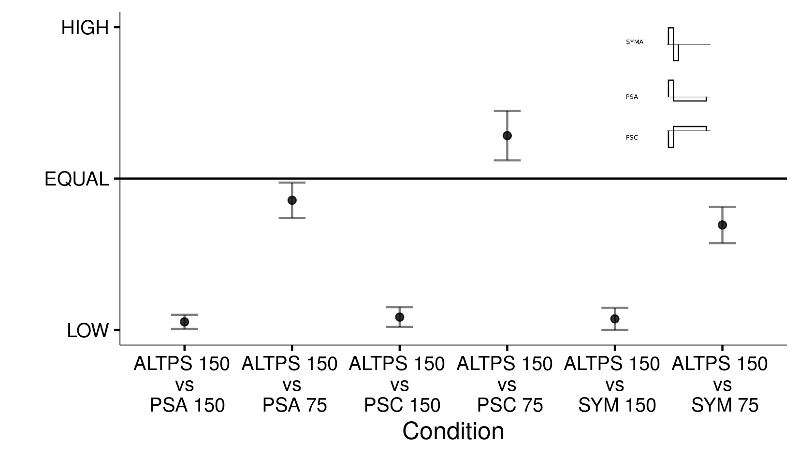
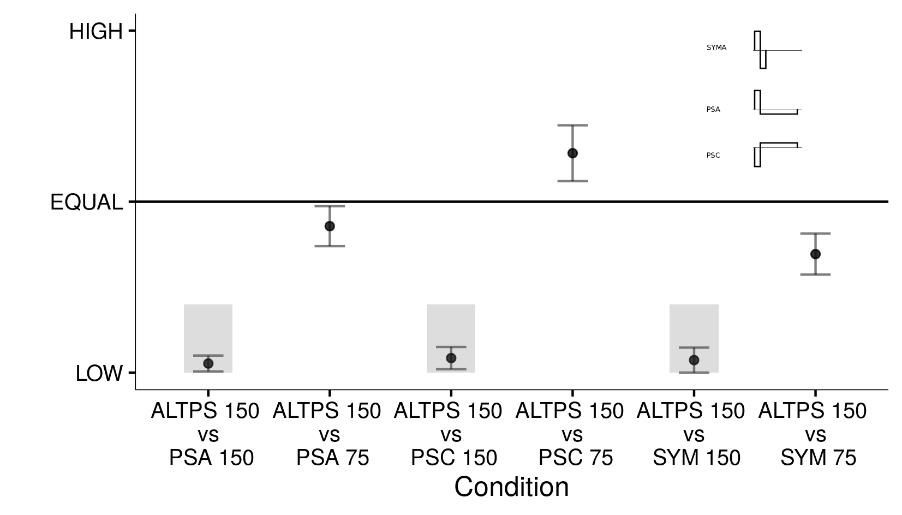
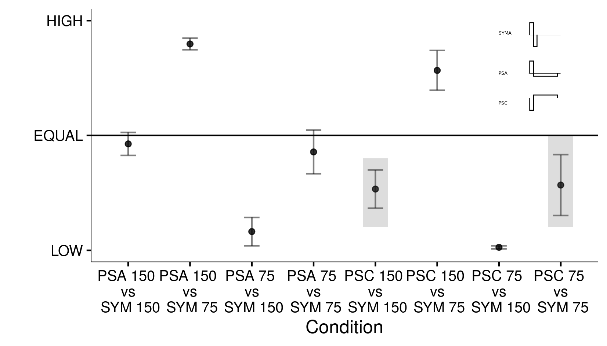

```{r setup, include=T, echo=FALSE}
knitr::opts_chunk$set(echo=FALSE, warning=FALSE, message=FALSE, kfigr.prefix=TRUE, kfigr.link=TRUE, comment=NA)
```


# Introduction

##
- Cochlear Implant (CI) users’ ability to discriminate pitch relies in both temporal and place cues. 
Temporal discrimination is usually (not a always) limited up to 300 pps.


> Poor electrode discrimination

> - Electrically stimulation of the AN is synchronized - lack of spontaneous activity compared to normal hearing (NH).
> - Spread of excitation along the cochlea can vary as a function of level.
> - Interaction ***place of excitation*** / ***level of stimulation*** (Townshend et al., 1987, Pijl, 1997).
<!-- > - Confounding factors; Subjects may be judging in basis of loudness rather than pitch cues (McKay and Henshall, 2010) -->
> - ***Stimulus polarity***


# Stimulus polarity

## Polarity Normal Auditory Nerve

|       Cathodic excitation                    |  Anodic excitation                     |
:---------------------------------------------:|:---------------------------------------:
|        |  |

- Anodic Threshold ***larger than*** Cathodic Threshold
- Anodic produces central excitation; Cathodic produces peripheral excitation (Rattay et al. 2001; ***see poster PS 270***)


## Partially/severe degenerated Auditory Nerve

|       Cathodic excitation                                   |  Anodic excitation                     |
:------------------------------------------------------------:|:---------------------------------------:
|        |  |


- Cathodic Threshold ***larger than*** Anodic Threshold
- Anodic produces central excitation; Cathodic produces peripheral excitation

## Human data


Loudness balancing Anodic vs. Cathodic (Undurraga et al., 2013)

- Similar effect observed with ECAPs and EABRs.


# Aims

##

- to evaluate how pitch is affected by stimulation level and polarity in human CI users
Objectives measures of pitch discrimination.

- to assess whether the acoustic complex change (eACC) can be used to measure pitch discrimination.

- to quantify the relationship between the eACC and behavioural discrimination.


# Experiment 1

## Methods

- ***Four users*** of the CII or HiRes90k CI.

- Pulse width 97 μs (***Unmodulated pulse trains; 500 ms***). 

- Monopolar stimulation (middle electrode).

- Stimulation levels: ***100, 50, and 25 % of the dynamic range (DR)***.

- Comfortable level (CL) and threshold (two-down one-up two-alternative forced choice 2AFC, 3 trials).

- Pulse shapes ***loudness balanced*** to 100 %, 50 %, and 25 %DR (McKay and Henshall, 2010).

- Subject had to rank which of two pulse trains (***loudness balanced***) was higher in pitch (50 trials/condition)
<!-- - 7 conditions (presented in a random order) -->

## Methods: Pulse shape

- Stimuli: SYM, PSA, PSC, and ALTPS at 150 or 75 pps. All PS stimuli had a 1/8 ratio. 


```{r, out.width = "300px"}

```


<!-- ## Methods: Loudness balancing -->

<!-- - Reference level was fixed and the subject was allowed to adjust the level of a target stimulus (gap of 500 ms / 2 repetitions). Procedure was repeated but the roles of the stimuli were alternated (2 repetitions).  -->

<!-- - The final balanced level of the target stimulus was calculated by subtracting the mean of the four level differences between the reference and the target signal from the starting comfortable level of the reference stimulus. -->


## Results
```{r comparisons_code}
library(foreign)
library(ez)
library(gridExtra)
library(stats)
library(grDevices)
library(lme4)
library(ggplot2)
library(plyr)
library(doMC)

source("~/Documents/source_code/r-tools/plot_set.R")


formater <- theme_bw() +  theme(panel.grid.major = element_blank(), 
                                panel.grid.minor = element_blank(),
                                panel.border = element_blank(),
                                panel.background = element_blank()) + 
  theme(axis.line.x = element_line(color="black", size = 1), axis.line.y = element_line(color="black", size = 1)) +
  theme(strip.background = element_blank()) +
  theme(legend.text=element_text(size=12), text = element_text(size=12))
             
load('./pitch_data.RData')


```

## Loudness growth


```{r loudness_contour, eval=F}

anovaLoudnessPLot = ezPlot2(
  preds = nonPar_Anova_anova_Loudness_mean_Boot
  , x = DR
  , split = PS
) 

anovaLoudnessPLot <- (anovaLoudnessPLot + xlab("% DR") +
                        ylab(expression(paste("Current Level [ref 1", mu, "A]", sep="")))
)
gp = anovaLoudnessPLot + formater
ggsave(filename = './my_figures/loundess_countour.png', plot = gp ,width = 14, height = 8, units = "cm")

```

|                                              |                              |
:---------------------------------------------:|:-----------------------------:
|  |  |


<!-- A two-way ANOVA (ALTPS, PSA,PSC, and SYMA):  -->

<!-- - thresholds [F (3, 9) = 41.6), p < 0.001]  -->
<!-- - DR [F (3, 9) = 25.0), p < 0.001],  -->
Mean difference between ALTPS and PSA, PSC, and SYMA:

- Threshold: ***5.3 dB*** /  CL: 0.5 dB  / DR: ***4.7 dB***


<!-- ## Results: Pitch ranking  -->

<!-- - Pitch ranking (proportion tests applied to each pair compared) -->


<!-- ```{r pitch_plot} -->
<!-- gp <- (ggplot(data = btests,  -->
<!--               aes(x = DR -->
<!--                   , y = PerceivedCat -->
<!--                   , colour = SUBJECT -->
<!--                   , group = SUBJECT -->
<!--                   , shape = SUBJECT -->
<!--                   , linetype = SUBJECT -->
<!--               )) -->
<!--        + geom_line(position = position_dodge(0.2)) -->
<!--        + geom_point(position = position_dodge(0.2)) -->
<!--        + facet_wrap(~ REF_PS_RATE_SIG_PS_RATE, ncol = 4, nrow = 4) -->
<!--        + theme(strip.text.x = element_text(size = 5)) -->
<!--        + ylab("Probability that pitch of first stimulus > second stimulus") -->
<!-- ) -->
<!-- gp + formater -->
<!-- ``` -->

## Pitch comparisons to ALTPS

Two-way non-parametric RM-ANOVA (ALTPS conditions and DR)

- condition p < 0.001 and DR % p = 0.029 were significant.

```{r pitch_alt_ps}
require(gridExtra)
require(png)
img <- readPNG("./my_figures/pulse-shapes-schematic.png")
g <- rasterGrob(img, interpolate=TRUE)
gp_an <-annotation_custom(g, xmin=5, xmax=6, ymin=0.6, ymax=1.0)

gp1 = ezPlot2(preds = nonPar_nonPar_anovaCondition_Boot,
             x = REF_PS_RATE_SIG_PS_RATE,
             do_lines = FALSE) +
  xlab("Condition") +
  ylab("") + 
  geom_hline(yintercept = 0.5) +
  scale_y_continuous(breaks=c(0,0.5,1.0), labels=c("LOW", "EQUAL", "HIGH"), limits = c(0,1)) +
  gp_an +
  formater

ggsave(filename = "./my_figures/anova_altps.png", plot =  gp1, width = 14, height = 8, units = "cm")

gp2 <- gp1 + 
  annotate("rect", xmin = 0.8, xmax = 1.2, ymin = 0.0, ymax = 0.2, alpha = .2) +
  annotate("rect", xmin = 2.8, xmax = 3.2, ymin = 0.0, ymax = 0.2, alpha = .2) +
  annotate("rect", xmin = 4.8, xmax = 5.2, ymin = 0.0, ymax = 0.2, alpha = .2) +
  gp_an


ggsave(filename = "./my_figures/anova_altps_highlighted.png", plot =  gp2, width = 14, height = 8, units = "cm")


```


<div style="position:relative; width:640px; height:480px; margin:0 auto;">  
 
 </div>


```{r}
require(gridExtra)
gp2 = ezPlot2(preds = nonPar_nonPar_anovaDR_Boot, 
              x = DR
              , do_lines = FALSE) +
  xlab("DR %") +
  ylab("") + 
  geom_hline(yintercept = 0.5) +
  scale_y_continuous(breaks=c(0,0.5,1.0), labels=c("LOW", "EQUAL", "HIGH"), limits = c(0,1)) +
  formater
ggsave(filename = "./my_figures/anova_altps_dr.png", plot =  gp2, width = 17, height = 10, units = "cm")

```

## Pitch comparisons to ALTPS

|                                             |                                |
|---------------------------------------------|--------------------------------|
|||


## PSA, PSC and SYM pitch ranking

<!-- A two-ways non-parametric RM-ANOVA (Pulse shape and DR)  -->
 
- Condition (p < 0.001) and DR % (p = 0.03) were significant.

```{r sym_and_ps}
gp_an <-annotation_custom(g, xmin=7, xmax=8, ymin=0.6, ymax=1.0)

gp1 = ezPlot2(preds = nonPar_anovaDRPlot_nonALTPS_Boot,
             x = REF_PS_RATE_SIG_PS_RATE
             , do_lines = FALSE) +
  xlab("Condition") + 
  ylab("") + 
  geom_hline(yintercept = 0.5) +
  scale_y_continuous(breaks=c(0,0.5,1.0), labels=c("LOW", "EQUAL", "HIGH"), limits = c(0,1)) +
  gp_an +
  formater
ggsave(filename = "./my_figures/anova_altps_sym.png", plot =  gp1, width = 14, height = 8, units = "cm")

gp2 = ezPlot2(preds = nonPar_anovaDRPlot_nonALTPS_Boot,
             x = REF_PS_RATE_SIG_PS_RATE
             , do_lines = FALSE) +
  xlab("Condition") + 
  ylab("") + 
  geom_hline(yintercept = 0.5) +
  scale_y_continuous(breaks=c(0,0.5,1.0), labels=c("LOW", "EQUAL", "HIGH"), limits = c(0,1)) +
  annotate("rect", xmin = 4.8, xmax = 5.2, ymin = 0.1, ymax = 0.4, alpha = .2) +
  annotate("rect", xmin = 7.8, xmax = 8.2, ymin = 0.1, ymax = 0.5, alpha = .2) + 
  gp_an +
  formater
ggsave(filename = "./my_figures/anova_altps_sym_highlighted.png", plot =  gp2, width = 14, height = 8, units = "cm")


```


<div style="position:relative; width:640px; height:480px; margin:0 auto;">  
 
 </div>


## PSA, PSC and SYM pitch ranking


```{r}
gp2 = ezPlot2(preds = nonPar_anovaDRPlot_nonALTPS_Boot, 
              x = DR
              , do_lines = FALSE) +
  xlab("DR %") +
  ylab("") + 
  geom_hline(yintercept = 0.5) +
  scale_y_continuous(breaks=c(0,0.5,1.0), labels=c("LOW", "EQUAL", "HIGH"), limits = c(0,1)) +
  formater
ggsave(filename = "./my_figures/anova_altps_sym_dr.png", plot =  gp2, width = 17, height = 10, units = "cm")

```

|                                              |                              |
:---------------------------------------------:|:-----------------------------:
|  |  |


## Conclusions


- ***ALTPS 150 pps*** pulse trains elicited a ***lower pitch*** than PSA and SYMA
presented at ***150 pps***.


- On average ***ALTPS pulses*** elicited a ***lower pitch than PSA and SYM pulses presented at 75 pps*** but higher than PSC at 75 pps.

<!-- - As the DR % decreased, ALTPS was ranked lower than PSA or PSC and these lower than SYM pulses. -->

- PSC pulses elicited a lower pitch than ALTPS and SYM pulses presented at the same rate. This suggests that PSC pulses are exciting more apically than other pulse shapes.

- ALTPS 150 pps pulse trains have ***thresholds*** that were on average ***5.3 dB lower*** than other pulse shapes and DR around 4.7 dB wider than other pulse shapes.

<!-- - This suggests that at threshold levels both polarities in the ALTPS stimulus contribute to the detection threshold. -->


# Experiment 2


## Methods: artifact analysis

- 2 Adult Medel and 3 Advanced Bionics (AB) users
- Biphsic pulses, 800ms pulse train, loudness balanced

```{r, out.width = "300px"}
knitr::include_graphics("./my_figures/conditions_tested.svg")
```


## Methods: EEG

Recording:

- 68 channel active electrode system
- 300 trials at 0.51Hz

Analysis: 

- low pass filter 30Hz, high pass filter 2Hz
- automatic removal of bad channels
- denoising source separation
- weighted average

Data presented at Cz with reference at contralateral mastoid

## Results

<!-- ```{r, out.width = "800px"} -->
<!--  -->
<!-- ``` -->

## Artifact rejection


## Artifact rejection

```{r, out.width = "400px"}
knitr::include_graphics("./my_figures/artifact_supra_sub.png")
```


## Methods part 2

- 10 Advanced Bionics Users (2 pre lingual), tested at 1 week after switch on 

- Stimuli: electrodes 1-2, 2-3, 3-4, 4-5

- EEG: objective electrode discrimination pass defined as Visual identification of eACC N1P2 amplitude > 2 x residual noise level

- Behavioural electrode discrimination: 3-interval 2-alternative forced choice task with 20 trials per electrode pair. ***Successful discrimination score ≥ 80%***.

## Results


```{r, out.width = "500px"}

```

|          |      Behavioural Fail |  Behavioural Pass |
|----------|:---------------------:|------------------:|
| eACC Fail |  15                   |     1             |
| eACC Pass |  3                    |    21             |

- For more details see poster ***PS 726***


## Conclusions

- Electrical artifact can be reliable removed for all device tested.

- The eACC is a valid and reliable measure of electrode discrimination in CI users.


## General Conclusions

- The polarity sensitivity of the AN may produce unexpected excitation patterns along the AN reducing speech representation.

- Both, place and temporal representation interect with stimulation levels.

- These factors need to be taken into account in future novel stimulation strategies (electrode activation, pulse shape). 

- Objective measures such as eACC could be a potential ***tool to assess electrode discrimination***.


## Acknowledgments

|                                 |                                |                                |
|:-------------------------------:|:------------------------------:|:------------------------------:|
|   |      |    | 
| Rajeev Mathiew                  | Debi Vickers                   | Astrid van Wieringen           | 
| UCL                             | UCL                            | KU Leuven                      | 

- Thank to all the participants. 
- Thank to you for listening.

